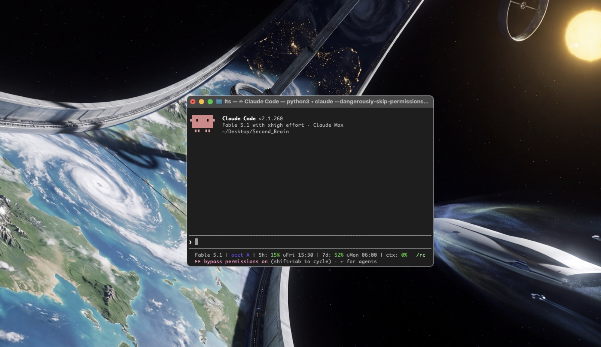

# Terminal Tunnel Vision

A full-screen piece of art with a hole cut around the one window you are working in.

Your real desktop is untouched. Tunnel Vision is a floating panel that sits above every other window, ignores the mouse entirely, and follows whatever window is frontmost. Summon it, work inside the hole, and everything else on the screen is art. Cycle between your terminal windows and your editor windows with one hand; each one you land on is centred for you, and put back where it was when you leave.



## Hotkeys

> **It has to be the RIGHT Option key.** Left Option deliberately does nothing, so word-jump keeps working in your shell and editor. If nothing happens when you press these, you are holding the wrong one. Ctrl+Option also works, on either side.

They are global, so they work while you are typing in the focused window.

| keys                   | action                                                  |
|------------------------|---------------------------------------------------------|
| right ⌥ ← / right ⌥ →  | cycle terminal windows                                  |
| right ⌥ ↑ / right ⌥ ↓  | cycle editor windows                                    |
| right ⌥ Space          | window picker: click a row, or press its number         |
| right ⌥ \              | give the framed window a different wallpaper            |
| right ⌥ C              | centre the front window                                 |
| right ⌥ Esc            | exit, putting every window it moved back where it was   |

The same list is in the app's menu bar while it runs, and is printed when you start it from a terminal.

Launching Tunnel Vision, or Cmd+Tabbing to it, hands keyboard focus straight to the framed window, so you can type without clicking first. Clicking into the framed window keeps the art up. Switching to any other app drops the art and restores the windows; coming back brings it up on the window you were last on.

The two pools remember their place independently. From a terminal, ⌥ ↑ takes you to the editor you last used, and ⌥ ← takes you back to the same terminal rather than the one before it. Only a second press in the same direction steps along a pool, so alternating between a terminal and an editor bounces between exactly those two windows instead of walking you through both lists.

While the picker is open it takes the keyboard: a bare number key picks that row and Esc closes it, no modifier needed.

**Each window keeps its own wallpaper.** The first time you land on a window it takes the next wallpaper in your list and holds it for as long as that window is open, so arrowing back always brings up the same art. The art becomes how you recognise a window before you have read a word of it. Right ⌥ \ re-assigns the framed window, so you choose which art marks which. List more wallpapers than you have windows and no two look alike. Assignments last for the session, not across restarts.

New windows are picked up on your next cycle and join the end of the order. Closed windows drop out, and minimised ones are skipped.

The Dock and Cmd+Tab tile follow the wallpaper you are on, drawn as a terminal window sitting on that art, so the switcher shows the tunnel you are about to return to rather than a fixed logo.

## Install

macOS only: it is built on AppKit, the Accessibility API and a CGEvent tap.

```
pip install -r requirements.txt
python3 tunnel.py --setup
python3 tunnel.py
```

`--setup` lists the apps you have open and asks which are your terminals and which are your editors, then writes them to the config file. Run it once before anything else: everyone's editor is different, and the built-in defaults are only a guess at common ones.

It then offers to build `~/Applications/Terminal Tunnel Vision.app` and add it to your Dock. Take it. Run as a bare script the process appears as "Python" with no identity of its own, and only a bundle gives it a real Dock tile and Cmd+Tab entry. Open the app once from Finder afterwards, since a bundle needs its own Accessibility grant, separate from your terminal's.

Grant Accessibility access when macOS asks (System Settings > Privacy & Security > Accessibility). Without it Tunnel Vision cannot see which window is in front or move windows. Run from a terminal, it inherits that terminal app's grant; a `.app` bundle needs its own.

Three wallpapers ship in `wallpapers/` and are used when you have not chosen any, so the third command above works on a fresh clone.

## Wallpapers and configuration

`~/.config/terminal-tunnel-vision/config.json`:

```json
{
  "wallpapers": [
    "~/Pictures/wallpapers/orbital.png",
    "~/Pictures/wallpapers/solarpunk.png"
  ],
  "terminals": ["Terminal", "Ghostty"],
  "editors": ["Zed"]
}
```

- `wallpapers` are cycled with ⌥ \ in this order. Any size works; each is decoded once and scaled to your screen. With no `wallpapers` key, every image in the `wallpapers/` folder next to `tunnel.py` is used.
- `terminals` and `editors` are app names as macOS reports them, written by `--setup` or edited here by hand. The defaults, used when a key is absent: Terminal, iTerm2, Warp, Ghostty, Alacritty, kitty, and TextEdit, CotEditor, BBEdit, Sublime Text, Code, Cursor, Zed. `python3 tunnel.py --list` prints the windows currently in each pool, which is the quickest way to check that a name matches.

Image paths on the command line replace the config list. `--start PATH` keeps the config list but begins on that image.

## A double-clickable app

```
python3 make_app.py "Tunnel Vision"                       # -> ~/Desktop/Tunnel Vision.app
python3 make_app.py "Orbital" --start ~/wp/orbital.png    # starts on that wallpaper, icon from it
```

The bundle wraps the Python interpreter you ran `make_app.py` with, takes its icon from the start wallpaper, and logs to `~/.config/terminal-tunnel-vision/launch.log`. It needs its own Accessibility grant the first time you open it.

## Other commands

```
python3 tunnel.py --setup     # choose which apps count as terminals and editors
python3 tunnel.py --list      # show the terminal and editor window pools
python3 tunnel.py --quit      # ask the running instance to restore its windows and exit
python3 tunnel.py --restore   # after a crash: put windows back from the sidecar
```

Every window Tunnel Vision moves is written to `~/.config/terminal-tunnel-vision/restore.json` before the move, so a crash or a `kill` never strands your windows off-centre.

## How it works

- The scrim is a borderless, non-activating `NSPanel` at floating level with `ignoresMouseEvents` on, so it can never take a click, steal focus, or hide a window from you.
- A 15 Hz timer reads the frontmost window through the Accessibility API and redraws the hole.
- Hotkeys come from a session-level `CGEventTap`. macOS reports the two Option keys with different device bits, so only right-Option chords are consumed and left Option is untouched.
- Cycling is `AXRaise` plus, when the target belongs to a different app, a System Events `set frontmost` — the one activation route that works from a process that is not itself active. A cycle measures around 12 ms.
- Transient collection behaviour keeps the panel on every Space but out of Mission Control and Show Desktop.

Every display gets its own scrim, and a window is centred on the display it is already on rather than dragged to the main one. A window straddling two screens gets its share of the hole on both. Plugging a monitor in or out rebuilds the scrims, so a new screen is covered without a restart.

## License

MIT. Built with Claude Code.
